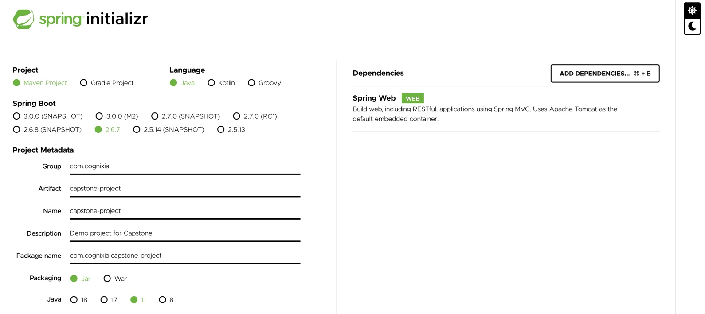

# Introduction
In this 3-day Capstone project, you'll deploy an HTTP web API to a managed Kubernetes cluster like AKS. When working on this project, think of it as a real-world application and make sure to keep it **production** grade.

# Pre-reqs
This is a group project. Choose your team and create a shared Github repository (private).

# Description
Choose a technology for the HTTP web API that you are comfortable with. It could be NodeJS, Java or any other technology that supports building web API. My preference is that you use Java Spring Boot since it is very easy to work with.

Understand that this is an API, and hence a User Interface is optional. The API should be able to do the following: (if you don't know the logic for the following, please Google):
- GET /{any_number} should return the roman numeral equivalent of that number
- GET /ping should return the static text "pong". This will be used for health check later.

If you choose to use Java Spring Boot then:
- Navigate to [Spring Initializr](https://start.spring.io/)
- Provide the following details:
    - Group: `com.cognixia`
    - Artifact: `capstone-project`
    - Description: `Demo project for Capstone requirements`
- Click on **ADD DEPENDENCIES** button, and search for "Web" and add the dependency for **Spring Web**

Compare your configuration with the following screenshot

- Click on **GENERATE** and download the project to your local. This is an empty Spring boot project but has all the required dependencies.

# Project requirements
1. Add detailed instructions in README.md to build, run and test the project in local.
2. Dockerize the application and store the image on public Docker repository. Since you're working as a team, you can use anyone account to store the image or create one for your team. **THIS ONLY FOR DEVELOPMENT. FOR PRODUCTION RELEASE, YOU'LL USE ACR.**
3. Create a Kubernetes Cluster on Azure using Terraform and make sure that all your teammates have acces to it.
4. Create a namespace in the cluster where the application will be deployed
5. In the cluster:
    - Deploy the application in a dedicated namespace
    - Provide access to it from outside of the cluster using ingress controller. **NO NEED TO USE DNS NAME. PUBLIC IP WILL DO**. You can either install ingress controller or use the HTTP application routing. It's your choice.
7. Create an Azure DevOps pipeline to do the following:
    - Build:
        - Checkout code from your Github
        - Validate that the code does not have any coding violations
        - Validate that there are no compilation errors
        - Build the docker image
        - Store the Docker image on ACR
    - Release:
        - Deploy the application to dev, qa, stage and prod namespaces
8. Make sure that the service's Kubernetes manifests have liveness and readiness probes defined in them.
9. Update your README with the links to access the service in all the 4 environments

Follow all the standard development practices like reviewing pull requests, using development branches etc.

# Extra credits
- A dashboard to monitor:
    - Response times from the application
    - Memory and CPU usage of PODs
- Use of Cache to store frequent responses
- Not copying the code from the learning repositories.
- Extensive documentation on how the application works
- Not using LOADBALANCER service type to expose the service outside the cluster.
- Using ticket numbers to track work. For this you can use the **Issues** in Github to create issues. Each issue is assigned a unique ID. Create a branch with that ID and work on it.
- Additional settings in the Github repo to ensure no one can merge to main branch directly.

# Deliverables
Github repository for the project. Don't forget to add **saikiranchalla1** as the collaborator in the project.

